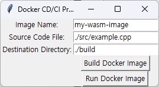

# BuildTool 사용 설명서
BuildTool은 Docker를 이용해 C++ 프로젝트를 WebAssembly로 빌드하는 Python 기반 GUI 툴입니다. 이 도구를 사용하면 Docker 이미지를 빌드하고, 선택한 C++ 파일을 WebAssembly로 컴파일할 수 있습니다. 사용자는 빌드할 이미지 이름을 지정하고, C++ 소스 코드 파일을 선택한 후 결과물을 저장할 경로를 지정할 수 있습니다.

## 구성
해당 툴이 사용하는 도커파일은 eigen라이브러리를 설치하고 있습니다.
BuildTool에서는 emcc를 이용하여 설치된 eigen라이브러리와 src에 있는 include 폴더를 링크하고 있습니다.
Header-only방식의 라이브러리(libigl)를 include안에 넣었고 연결되는지 테스트해보았습니다.

## 사용 방법
### 1. BuildTool 실행
BuildTool.py 파일을 Python 3 환경에서 실행합니다.
```bash
python BuildTool.py
```
### 2. Docker 이미지 이름 입력
프로그램의 Image Name 필드에 빌드하고자 하는 Docker 이미지의 이름을 입력합니다.
### 3. 빌드할 C++ 파일 선택
Source Code File 옆의 Browse 버튼을 클릭하여 빌드할 C++ 파일을 선택합니다. 상대 경로 사용을 추천합니다.
### 4. 빌드 출력물 저장 경로 선택
Destination Directory 옆의 입력 필드에 빌드 결과물을 저장할 경로를 입력합니다. 상대 경로 사용을 추천합니다.
### 5. Docker 이미지 빌드
Build Docker Image 버튼을 클릭하여 단계 2에서 입력한 이름으로 현재 경로에 있는 Dockerfile로부터 Docker 이미지를 생성합니다.
### 6. C++ 파일 빌드
Run Docker Image 버튼을 클릭하여 단계 3에서 선택한 C++ 파일을 컨테이너로 넘기고, WebAssembly로 빌드합니다. 빌드 결과는 단계 4에서 지정한 경로에 저장됩니다.

## 주의 사항
이 툴은 Docker와 Python 3이 설치된 환경에서 사용 가능합니다.
빌드 프로세스는 Docker를 사용하여 수행되므로, Docker가 정상적으로 작동하는지 확인해주세요.
상대 경로를 사용할 때는 실행하는 현재 위치를 기준으로 경로가 계산됩니다.


## 예제
이미지 이름: *my-wasm-image*
빌드할 C++ 파일: *./src/example.cpp*
빌드 출력물 저장 경로: *./build*



1. BuildTool.py를 실행합니다.
2. *Image Name*에 *my-wasm-image*를 입력합니다.
3. *Source Code File*에 *./src/example.cpp* 파일을 입력합니다.
4. *Destination Directory*에 *./build*를 입력합니다.
5. *Build Docker Image*를 클릭하여 Docker 이미지를 빌드합니다.
6. *Run Docker Image*를 클릭하여 C++ 파일을 WebAssembly로 컴파일하고, 결과를 지정한 경로 *./build* 에 저장합니다.

이 도구를 사용하면 Docker를 활용하여 C++ 프로젝트를 쉽게 WebAssembly로 빌드할 수 있습니다.